Lab Assignment 6 Observer pattern
---
**Real-time News Subscription Service**

**Background:** _You're tasked with designing a real-time news subscription service for a media company. The system needs to notify subscribers about breaking news as soon as it's published by the news agency._

**Scenario Description:** _The system comprises two main components: NewsAgency and Subscriber._

- **NewsAgency:** _Represents the central hub for publishing news. It maintains a list of subscribers and notifies them whenever new news is available._

- **Subscriber:** _Represents users or entities subscribed to the news service. Subscribers receive immediate notifications about any breaking news published by the agency._

**Requirements:**

1. **Subscription Management:**
- _Users should be able to subscribe to the news service._
- _Subscribers should be notified promptly when new news is published._
2. **Dynamic Subscription Updates:**
- _The system should allow for dynamic subscription updates. Subscribers can subscribe, unsubscribe, or modify their preferences without disrupting other subscribers._
3. **Decoupled Communication:**
- _Ensure that the communication between the news agency and subscribers is decoupled. Subscribers shouldn't directly request news updates but should be notified by the news agency when new information is available._

**Expected Behavior:**
- _When the news agency publishes breaking news, all subscribed users should receive immediate updates._
- _Subscribers can join or leave the service without affecting the delivery of news to other subscribers._
- _The system should provide flexibility for future enhancements, such as personalized subscriptions or categorization of news updates._

**Constraints:**
- _The system should be scalable to handle a growing number of subscribers without compromising performance._
- _Ensure that the implementation follows object-oriented design principles and promotes loose coupling between the news agency and subscribers._

**_In your solution you must provide the following in your Github link account:_**
- Problem statement (description of the problem. Just copy what is stated here.
- UML Class Diagram
- Uploaded java codes for the solution.

